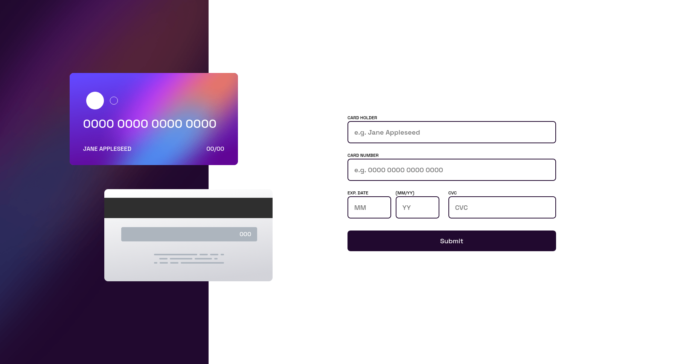
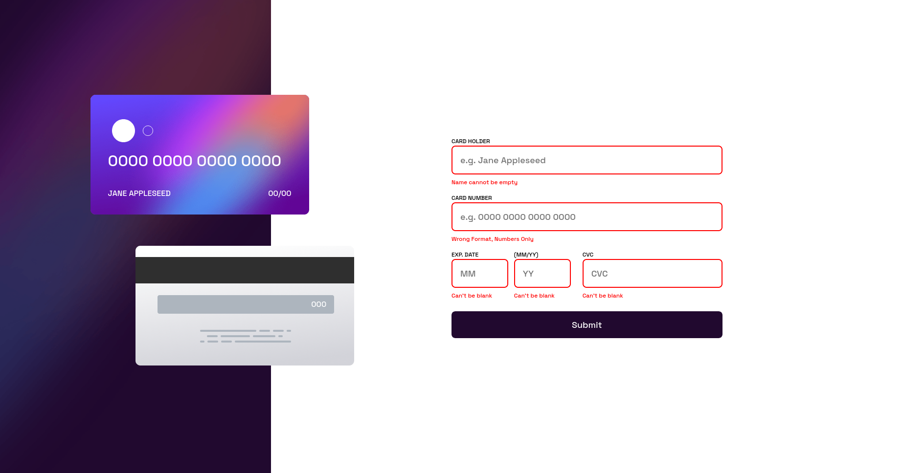

# Frontend Mentor - Interactive card details form solution

This is a solution to the [Interactive card details form challenge on Frontend Mentor](https://www.frontendmentor.io/challenges/interactive-card-details-form-XpS8cKZDWw). Frontend Mentor challenges help you improve your coding skills by building realistic projects.

## Table of contents

- [Overview](#overview)
  - [The challenge](#the-challenge)
  - [Screenshot](#screenshot)
- [My process](#my-process)
  - [Built with](#built-with)
  - [What I learned](#what-i-learned)
  - [Useful resources](#useful-resources)
- [Author](#author)

## Overview

### The challenge

Users should be able to:

- Fill in the form and see the card details update in real-time
- Receive error messages when the form is submitted if:
  - Any input field is empty
  - The card number, expiry date, or CVC fields are in the wrong format
- View the optimal layout depending on their device's screen size
- See hover, active, and focus states for interactive elements on the page

### Screenshot

#### Front Page

#### Error Page

#### Successful page

## My process

### Built with

- Semantic HTML5 markup
- CSS custom properties
- Flexbox
- Mobile-first workflow
- [React](https://reactjs.org/) - JS library
- [Vite](https://vitejs.dev/) - Build tool
- [Typescript](https://www.typescriptlang.org/)

### What I learned

- Understood the `position` property in CSS
- Used typescript
- Used the formik forms and learnt how to customize them to my need

### Useful resources

- [For credit card input](https://codepen.io/al3ka/pen/PoOejJY)

### Github URL

- Github - [interactive-card-detail](https://github.com/Divyue30597/interactive-card-details.git)

## Author

- Frontend Mentor - [@Divyue30597](https://www.frontendmentor.io/profile/Divyue30597)
- Github - [Divyue30597](https://github.com/Divyue30597)

## Todo

- implement the mobile and tablet version
